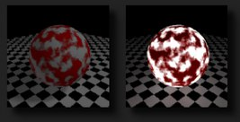

# Объявление
🎉 Добрый вечер, коллеги!

🖼 Третья лабораторная работа на наложение текстур выдана!

Условие можно найти в шареной папке в закрепе или прямо по ссылке (https://docs.google.com/document/d/1CDxzRP96P2U5yEl6Z4pAu37lSlHoQGf4qxIEru0qInc/edit?usp=sharing).

Вариантов у этой лабы нет. Есть условия только на базовую оценку 3 и базовую оценку 4. Доп. задания присутствуют.

veekay содержит API veekay::graphics::Texture, чтобы инициализировать все нужные для текстуры структуры Vulkan (вам понадобится оттуда только view, который нужен чтобы связать индекс дескриптора с самой текстурой)

Пример загрузки текстуры можно найти в презе на текстурирование.

Библиотека lodepng для загрузки PNG изображений из файла уже есть в testbed.

# Условие
Цель лабораторной работы:
В этой лабораторной работе вам предстоит загрузить изображение из файла, создать текстуру из изображения и, используя текстурные координаты, а также сэмплеры, наложить текстуру на объекты

Требования:
Вы должны использовать Vulkan, GLFW и ImGUI. Стартовый код уже всё это содержит, но если хотите попробовать без него, то я похвалю за отвагу!
P.S. Если хотите программировать на Direct3D под Windows, то используйте именно Direct3D 12, потому что он схож c Vulkan по принципам

Базовое условие на 3:
- Загрузить изображение из файла (желательно, чтобы ширина и высота изображения имели значение степени двойки, сами знаете зачем)
- Создать текстуру из изображения (использовать veekay::graphics::Texture)
- Создать объект сэмплера и задать разумные параметры сэмплирования
- Записать в набор дескрипторов новую привязку (дескриптор – изображение+сэмплер), чтобы его увидел фрагментный шейдер
- Вершины объектов должны содержать текстурные координаты
- Фрагментный шейдер должен сэмплировать текстуру, используя текстурные координаты, которые были переданы из вершинного шейдера

Базовое условие на 4:
- Условие то же, что и у базового условия на оценку 3, но расширяется следующими требованиями:
- Реализовать использование разных текстур (VkImageView) и сэмплеров (VkSampler) моделями на сцене (с помощью использования разных наборов дескрипторов для каждой текстуры или набора текстур, то есть “материала”)

Пояснение: у нас был один набор дескрипторов (descriptor_set), который связывал индексы внешних ресурсов шейдеры с самими ресурсами (uniform buffer для структур SceneUniforms и ModelUniforms, shader storage buffer для массивов источников освещений и combined image sampler для пар изображение + сэмплер).
Поскольку перевязывать индексы одного набора дескриптора с другими текстурами во время рисования объектов одним граф. конвейером нельзя (причины понятны, команды GPU vkCmdXXX исполнятся после функции render), то заранее требуется создать множество наборов дескрипторов, где индексы текстур будут связаны с разными текстурами.

В этой работе дается простор для креатива: можете использовать любые изображения и любые параметры сэмплеров, которые наиболее подходят под вашу сцену и вайб

Оценивание:
Вы должны выполнить одно из базовых условий: либо на оценку 3, либо на оценку 4. Чтобы повысить оценку, нужно сделать до двух дополнительных заданий из списка ниже. Каждое выполненное дополнительное задание даёт пол-балла.

Дополнительные задания:
- Сделайте нетривиальное сэмплирование текстуры в шейдере (можно модулировать входящие текстурные координаты какой-либо сложной функцией в шейдере; также можно сэмплировать много раз и смешивать цвета множества текселей по нетривиальной схеме)
- Реализуйте две (или больше) дополнительные текстуры, описывающие материал, например specular текстуру (для определенных участков, где будут видны блики) и emissive текстуру (для участков, которые будут игнорировать просчет освещения и затенения, они будут светиться в темноте)

# Доп материалы
ℹ Немножко техник и пояснительной информации по дополнительным пунктам:

1. Текстуры-заглушки:

Если материал будет содержать помимо базовой текстуры (albedo) ещё другие, например текстуры для блика (specular) и текстуры для свечения (emissive), но у конкретного материала их нет, то вместо того, чтобы рисовать её самому можно вставить заглушку.

Обычно в движках используются две заглушки: белая и чёрные текстуры.

veekay::vec4 white = {1.0f, 1.0f, 1.0f, 1.0f};  
one_texture = new veekay::graphics::Texture(
cmd, 1, 1, VK_FORMAT_R32G32B32A32_SFLOAT, &white);

Тогда в матриале можно указать эти текстуры, как заглушки для specular и emissive

2. Нетривиальное сэмплирование текстур

Чем шакальнее интереснее, тем лучше. Можно сделать 3D-анаглиф или придумать странную функцию, которая модулирует текстурные координаты, как я показывал на лекции.

🔦 Про emissive текстуры:

Такие текстуры будто накладываются "поверх" объекта и полностью игнорируют просчеты коэффициента затенения.

По сути нужно просто добавить в финальный цвет пикселя цвет сэмпла из emissive текстуры
