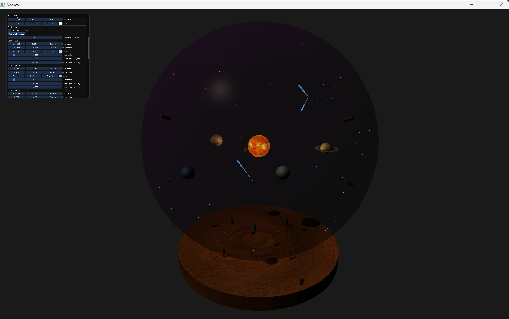
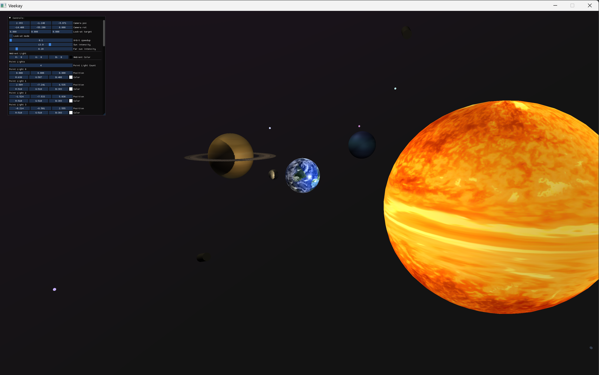

# 🌌 Solar System in a Glass Sphere (Vulkan)

3D rendering project built on top of a Vulkan-based engine (Veekay).

The project visualizes a solar system scene enclosed in a glass sphere, focusing on rendering, lighting and visual composition.


## 🚀 Features

* 🌍 3D solar system scene
* 🔮 Glass sphere effect
* 💡 Lighting and shading setup
* 🌀 Orbital motion simulation
* 🎮 Real-time rendering using Vulkan


## 🧠 What I Did

* Implemented custom scene inside Vulkan-based engine
* Built solar system visualization (planets, orbits, scaling)
* Worked with rendering pipeline and shaders
* Adjusted lighting and materials for better visuals
* Integrated scene into existing engine architecture


## 🛠 Tech Stack

* C++20
* Vulkan
* GLFW
* ImGui
* CMake


## 🧩 Project Structure

* `source/` — engine code (Veekay)
* `testbed/` — application logic and rendering (main work here)


## 🖼️ Preview

<p align="center">
  
  
</p>
<p align="center">
  
</p>

## ⚙️ Build & Run

```bash
cmake --preset debug
cmake --build build-debug --parallel
```

Run:

```bash
./build-debug/testbed
```


## 📌 Notes

This project is based on an existing Vulkan engine and extended with custom rendering logic and scene implementation.


## 📫 Author

Denis Avramenko
